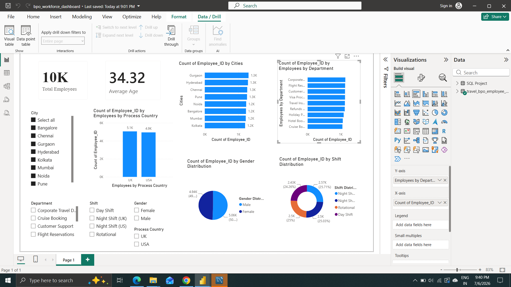

# Travel BPO Workforce Analytics
## End-to-End Data Analytics Project

---

## Project Overview
End-to-end data analytics project analysing **10,000 
Travel BPO employee records** across 8 Indian cities 
serving US and UK processes. This project demonstrates the complete data analytics workflow, from synthetic data generation using Python (Faker) to SQL analysis, Python-based exploratory data analysis (EDA), and an interactive Power BI dashboard for business insights.

---

## Problem Statement
Analyse workforce distribution, demographic patterns, 
shift operations, and city-wise insights for a Travel BPO 
company operating US and UK processes from major 
Indian cities.

---

## Dataset
- **Records:** 10,000 synthetic employee records
- **Source:** Generated using Python (Faker library)
- **Industry:** Travel BPO (US/UK Process)
- **Columns:** Employee ID, Name, Age, Gender, City, 
  Process Country, Department, Process Type, Shift

---

## Project Structure

### Part 1: Data Generation
**File:** `01_data_generation.ipynb`
- Generated 10,000 realistic BPO employee records
- Used Python Faker library
- Modeled on real Travel BPO industry structure
- Tools: Python, Pandas, Faker, NumPy

### Part 2: SQL Analysis
**File:** `bpo_sql_analysis.sql`
- 13 SQL queries covering complete workforce analysis
- Techniques used:
  - GROUP BY and aggregations
  - HAVING clause
  - CASE statements
  - Subqueries
  - Window Functions (RANK)
  - CTEs (Common Table Expressions)
- Tools: MySQL Workbench

### Part 3: Python EDA
**File:** `02_python_bpo_eda.ipynb`
- Data cleaning and validation
- 6 professional visualisations
- Key findings and business insights
- Tools: Python, Pandas, Matplotlib, Seaborn

### Part 4: Power BI Dashboard
**File:** `bpo_workforce_dashboard.pbix`
- 7 interactive visuals
- 5 dynamic slicers
- KPI cards: Total Employees, Average Age
- Tools: Power BI Desktop

---

## Key Findings
1. Total workforce: **10,000 employees**
2. Gender split: **50.57% Male vs 49.43% Female**
3. Top city: **Gurgaon (1,304 employees)**
4. Most common shift: **Night Shift UK (2,571)**
5. Top process type: **Inbound Voice (2,034)**
6. Largest age group: **40+ Senior (2,770)**
7. Nearly equal distribution between US and UK processes (approximately 50% each).

---

## Dashboard Preview

---

## Tools & Technologies
| Tool | Purpose |
|------|---------|
| Python (Faker) | Synthetic Data Generation |
| Pandas, NumPy | Data Manipulation |
| Matplotlib, Seaborn | Data Visualisation |
| MySQL Workbench | SQL Analysis |
| Power BI Desktop | Interactive Dashboard |
| Jupyter Notebook | Development Environment |
| GitHub | Version Control |

---

## Skills Demonstrated

- SQL Queries
- Exploratory Data Analysis (EDA)
- Data Cleaning
- Data Visualization
- Dashboard Design
- Power BI
- Business Intelligence
- Workforce Analytics
- Business Insight Generation
- Synthetic Data Generation
- Statistical Analysis

---

## Author
**Asmita Katake**
| Computer Engineering Graduate | Aspiring Data Analyst

---

**Connect with Me**

- LinkedIn:https://linkedin.com/in/asmita-katake-441354231
- GitHub:https://github.com/Asmitakatake
